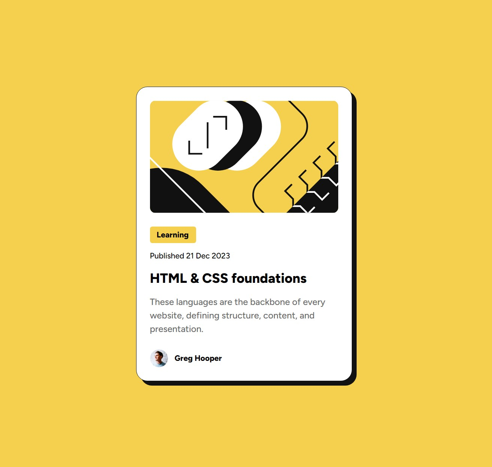

# Frontend Mentor - Blog preview card solution

This is a solution to the [Blog preview card challenge on Frontend Mentor](https://www.frontendmentor.io/challenges/blog-preview-card-ckPaj01IcS).

## Table of contents

- [Overview](#overview)
  - [The challenge](#the-challenge)
  - [Screenshot](#screenshot)
  - [Links](#links)
- [My process](#my-process)
  - [Built with](#built-with)
  - [What I learned](#what-i-learned)
  - [Continued development](#continued-development)
- [Author](#author)

## Overview

### The challenge

Users should be able to:

- See hover and focus states for all interactive elements on the page

### Screenshot



### Links

- Solution URL: [GitHub Repository](https://github.com/jonghwascript/blog-preview-card.git)
- Live Site URL: [Live Demo](https://jonghwascript.github.io/blog-preview-card)

## My process

### Built with

- Semantic HTML5 markup
- CSS custom properties (CSS Variables)
- CSS Grid
- Flexbox
- CSS Container Queries
- CSS Nesting
- BEM naming convention
- Mobile-first workflow

### What I learned

#### 1. Semantic HTML - footer in article

According to the HTML5 standard, the `<footer>` tag can be used not only for the footer of an entire webpage, but also for closing information (author, publication date, etc.) within an `<article>` or `<section>`.

```html
<article class="blog-card">
  <!-- Main content -->
  <footer class="blog-card__author">
    
    <span>Greg Hooper</span>
  </footer>
</article>
```

This clearly tells screen readers and search engines "this is where the card's main content ends and the author information begins."

#### 2. Responsive Width Strategy

The 375px and 1440px values provided by Frontend Mentor are **design canvas sizes**. They are not values to put directly in CSS, but reference points for reviewing the result in the browser.

```css
.blog-card-wrapper {
  width: 100%;        /* Shrinks flexibly when the screen gets smaller */
  max-width: 384px;   /* Won't expand beyond this size even on larger screens */
}

main {
  display: flex;
  height: 100vh;
  justify-content: center;
  align-items: center; /* Centers vertically and horizontally */
}
```

#### 3. CSS Container Queries

Container queries apply styles based on the parent container's size, not the viewport:

```css
main {
  container-type: inline-size;
  container-name: blog;
}

.blog-card-wrapper {
  --card-theme: mobile;

  @container blog (min-width: 400px) {
    & {
      --card-theme: pc;
    }
  }
}
```

#### 4. CSS Style Queries

Style queries enable conditional styling based on CSS custom property values:

```css
.blog-card {
  @container style(--card-theme: pc) {
    width: 384px;
  }
}
```

#### 5. CSS Custom Properties for Color Management

Using CSS variables improves maintainability:

```css
:root {
  --color-yellow: hsl(47, 88%, 63%);
  --color-black: hsl(0, 0%, 7%);
}

body {
  background-color: var(--color-yellow);
}
```

#### 6. Accessibility - Focus States

Focus styles for keyboard navigation support:

```css
.blog-card__link:focus-visible {
  outline: 2px solid var(--color-black);
  outline-offset: 2px;
}
```

### Continued development

- Explore `clamp()` function for fluid typography
- Learn more about CSS Container Queries use cases
- Improve accessibility with ARIA attributes

## Author

- Frontend Mentor - [@yourusername](https://www.frontendmentor.io/profile/yourusername)
